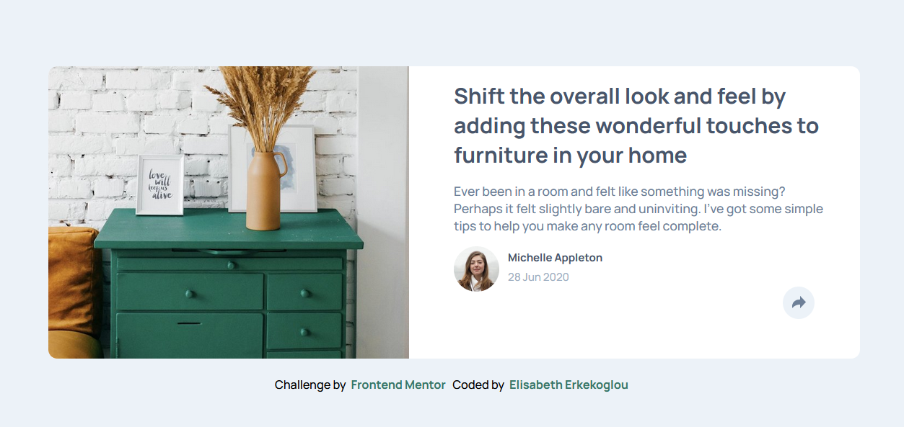
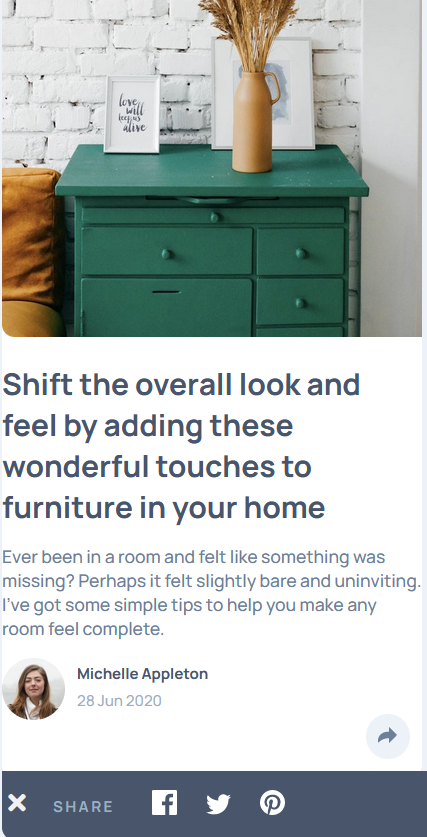

# Frontend Mentor - Article preview component solution

This is a solution to the [Article preview component challenge on Frontend Mentor](https://www.frontendmentor.io/challenges/article-preview-component-dYBN_pYFT). Frontend Mentor challenges help you improve your coding skills by building realistic projects.

## Table of contents

- [Overview](#overview)
  - [The challenge](#the-challenge)
  - [Screenshot](#screenshot)
  - [Links](#links)
- [My process](#my-process)
  - [Built with](#built-with)
  - [What I learned](#what-i-learned)
  - [Continued development](#continued-development)
  - [Useful resources](#useful-resources)
- [Author](#author)
- [Acknowledgments](#acknowledgments)

## Overview

### The challenge

Users should be able to:

- View the optimal layout for the component depending on their device's screen size
- See the social media share links when they click the share icon

### Screenshot

### Links

- Solution URL: [Add solution URL here](https://github.com/elic4vet/article-preview)
- Live Site URL: [Add live site URL here](https://courageous-cassata-c60229.netlify.app/)

## My process

### Built with

- Semantic HTML5 markup
- CSS custom properties
- Flexbox
- CSS Grid
- Mobile-first workflow
- [Styled Components](https://styled-components.com/) - For styles

### What I learned

I learned more about the use of the position property in CSS. I also learned how to use the z-index property to control the stacking order of elements. I also learned how to use the ::before and ::after pseudo-elements to create the shapes in the design.

### Useful resources

- [CSS-Tricks](https://css-tricks.com/almanac/properties/p/position/) - This helped me understand the position property in CSS. I really liked this pattern and will use it going forward.
- [MDN Web Docs](https://developer.mozilla.org/en-US/docs/Web/CSS/z-index) - This is an amazing article which helped me finally understand the z-index property in CSS. I'd recommend it to anyone still learning this concept.
- [CSS-Tricks](https://css-tricks.com/almanac/selectors/a/after-and-before/) - This helped me understand the ::before and ::after pseudo-elements in CSS. I really liked this pattern and will use it going forward.

## Author

- LinkedIn - [Elisabeth Erkekoglou ](https://www.linkedin.com/in/eerkekoglou/)
- Frontend Mentor - [@elic4vet](https://www.frontendmentor.io/profile/elic4vet)
- Instagram - [@elisa.codes23](https://www.instagram.com/elisa.codes23/)
